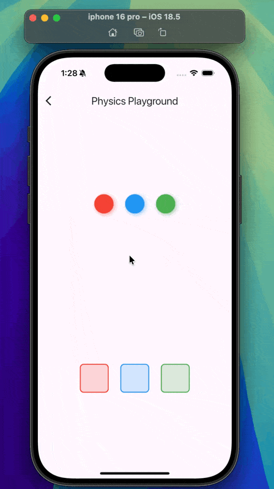

# ⚽ Physics Playground

An interactive **Flutter app** that demonstrates **drag-and-drop mechanics, animations, and physics-like interactions** in a fun and colorful way.  

This project is designed as a **playground** for experimenting with:

- 🎱 Draggable & DragTarget widgets  
- 🎨 AnimatedContainer for smooth transitions  
- 🌀 TweenAnimationBuilder for bounce/scale effects  
- 💡 Clean, beginner-friendly Flutter state management  

---

## 📸 Demo



---

## 🚀 Features

- 🎱 **Draggable Balls**  
  - Red, Blue, and Green balls that can be dragged.  
  - Balls shrink temporarily when dragged.  

- 🟩 **Color-Matching Targets**  
  - Drop each ball onto the matching target.  
  - Successful drops animate and show a ✅ checkmark.  

- 🌀 **Bounce Animation**  
  - Balls scale up slightly when being dragged for a "bounce" effect.  

- 🎨 **Custom UI Effects**  
  - Shadows under balls for a 3D look.  
  - Smooth color transitions on targets with `AnimatedContainer`.  

---

## 🏗️ Project Structure

Interactive-Physics—use-Draggable-and-DragTarget/
├── lib/
│   ├── main.dart        # App entry point
│   └── home_view.dart   # Main UI and logic (draggable balls + targets)
├── screenshots/
│   └── demo.gif         # Project demo animation
├── test/
│   └── widget_test.dart # Default Flutter widget test
├── android/             # Android platform code
├── ios/                 # iOS platform code
├── web/                 # Web platform code
├── windows/             # Windows platform code
├── macos/               # macOS platform code
├── linux/               # Linux platform code
├── pubspec.yaml         # Dependencies & assets configuration
└── README.md            # Project documentation

---

## 🛠️ Code Overview

### `main.dart`

Initializes the **PhysicsPlayground** app and loads the `HomeView`.

```dart
void main() {
  runApp(const PhysicsPlayground());
}

home_view.dart

Implements the playground:
	•	_buildDraggableBall() → Creates draggable balls with bounce effect
	•	_buildTarget() → Creates targets that accept only the correct color ball
	•	_buildBall() → Animates ball scaling when being dragged
	•	_ballShape() → Defines the circular design with shadows

⸻

📦 Dependencies

This project uses only Flutter core libraries (no external dependencies).

⸻

▶️ Getting Started

1️⃣ Clone the repository

git clone https://github.com/Riyam224/Interactive-Physics---use-Draggable-and-DragTarget.git
cd Interactive-Physics---use-Draggable-and-DragTarget

2️⃣ Install dependencies

flutter pub get

3️⃣ Run the app

flutter run


⸻

🎯 Learning Outcomes

By exploring this project, you’ll learn:
	•	How to use Draggable & DragTarget
	•	How to animate with TweenAnimationBuilder
	•	How to build interactive UIs with stateful logic
	•	How to combine gesture + animation + UI effects

⸻

🤝 Contributing

Feel free to fork this repo, experiment with new physics, and submit pull requests! 🚀

⸻


